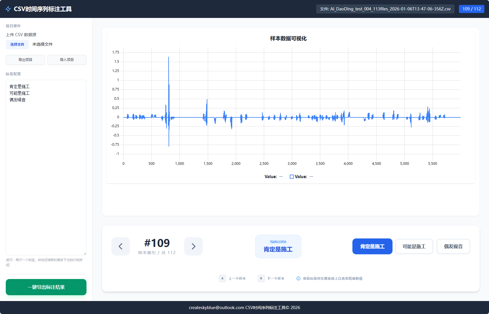

<!-- You can translate this document into English and create a README.en.md file, then add links here -->
<a href="./README.en.md">English Version</a> | <a href="./README.md">中文版</a>

# NanoEdgeAI CSV时间序列标注工具

## 项目简介

NanoEdgeAI CSV时间序列标注工具是一个基于Web的数据标注平台，专为时间序列数据的可视化与标注而设计。项目提供本地运行和快速部署能力，提升数据标注效率。

本工具主要面向数据科学家、机器学习工程师以及需要对时间序列数据进行结构化标注的研究团队。

## 主要功能

- **数据导入与解析**：支持CSV等格式的数据导入，使用Papa Parse进行高效解析
- **时间序列可视化**：基于uPlot轻量级图表库实现数据可视化
- **标签管理**：灵活的标签配置系统，支持自定义标签
- **数据导出**：一键导出标注结果到分类的CSV文件
- **项目备份与恢复**：支持项目状态的导入导出功能

## 演示



## 技术架构

- **前端框架**：React v19.2.3
- **语言**：TypeScript ~5.8.2
- **构建工具**：Vite ^6.2.0
- **图表库**：uPlot ^1.6.32
- **CSV解析**：Papa Parse ^5.5.3

## 快速开始

### 环境准备

确保您的系统已安装Node.js（版本需兼容npm）

### 安装与运行

1. **克隆或下载项目到本地目录**

2. **安装依赖**：
   ```bash
   npm install
   ```

3. **启动本地服务**：
   ```bash
   npm run dev
   ```

## 使用说明

### 数据导入
- 点击侧边栏的"上传 CSV 数据源"按钮，选择CSV文件
- CSV的每一行将被视为一个独立的时间序列样本

### 标签配置
- 在"标签配置"区域编辑标签，每行一个标签
- 修改后将即时更新下方的打标按钮

### 数据标注
- 使用键盘上的 A/D 键或点击箭头按钮切换样本
- 点击标签按钮为当前样本打标签
- 已标注的样本会显示在状态指示区域

### 数据导出
- 完成标注后，点击"一键导出标注结果"按钮
- 系统会按标签分类导出CSV文件

### 项目管理
- 使用"导出项目"功能保存当前标注进度
- 使用"导入项目"功能恢复之前的标注进度

## 构建与部署
```bash
npm run build
```


## 项目结构

```
.
├── App.tsx           # 主应用组件
├── uplot-wrapper.tsx # 图表组件封装
├── types.ts          # 类型定义
├── index.html        # 应用入口HTML
├── index.tsx         # React渲染入口
├── vite.config.ts    # Vite配置
├── lib/              # 第三方库
├── img/              # 图片资源
└── README.md
```
